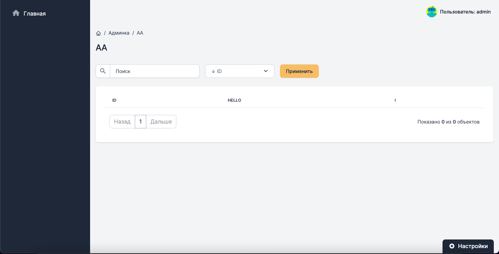
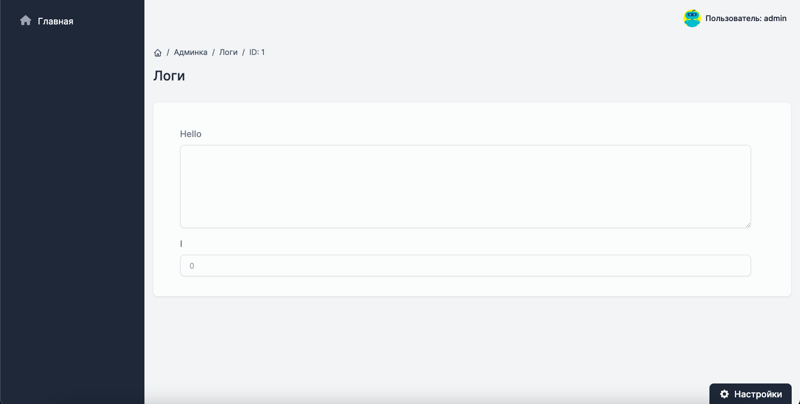
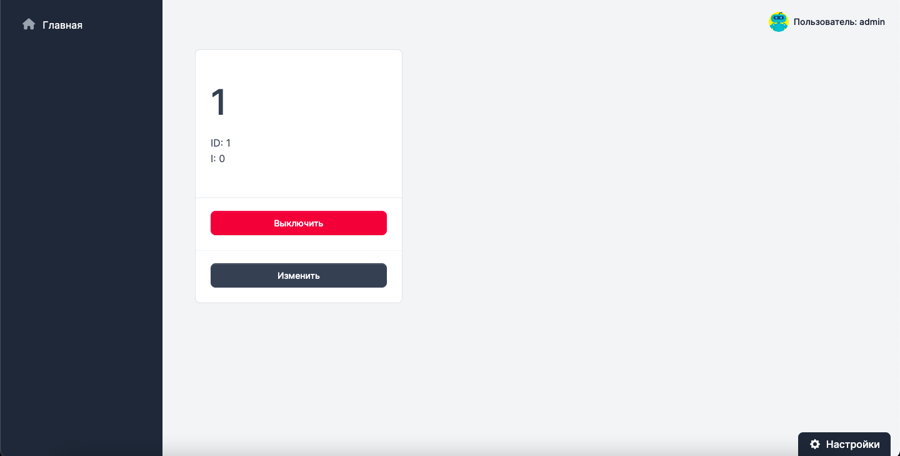
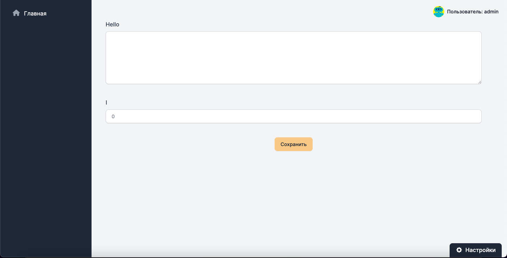
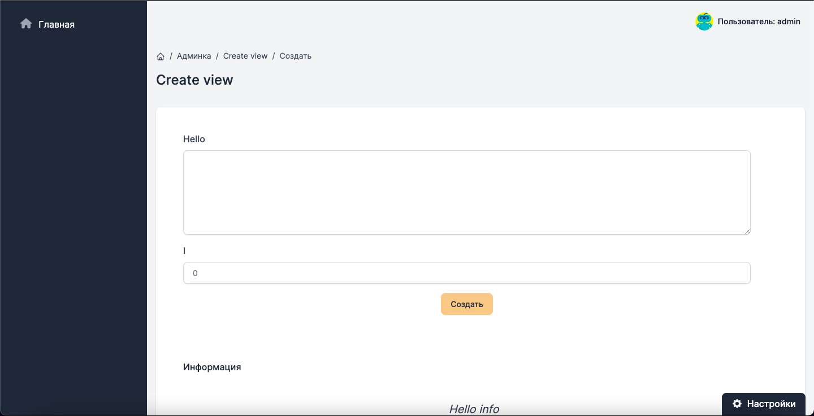
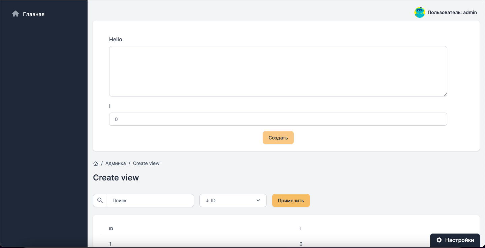

Admin Strong [For Django]
========================

## Django version
Django >= 3.2.13

## Django Settings
Settings for auth module
- LOGIN_REDIRECT_URL - page to redirect after login
- LOGOUT_REDIRECT_URL - page to redirect after logout

```python
LOGIN_REDIRECT_URL = "dashboard"
LOGOUT_REDIRECT_URL = "dashboard"
```
---
Config templates (p.s. if you didn't do this)
```python
TEMPLATE_DIR = os.path.join(BASE_DIR, "templates")

TEMPLATES = [
    {
        'DIRS': [TEMPLATE_DIR]
    }
]
```

---

## Urls
Include to urls 
```python
urlpatterns = [
    path('admin', include('admin_strong')),
]
```

---

## Url for DetailView
If you wanna use this view you need add url 

### <b>Example</b>

```python
urlpatterns = [
    ...
    path('url/<int:pk>', View.as_view(), name="url-name")
    ...
]
```

---

## Configuration

> admin_strong.configuration

| Variable | Information |
| -------- | ----------- |
| HELP_LINK | Link to support |
| NAVBAR | Navbar configuration |
| RELATED_MODEL_URLS | Related models links to admin |

### <b>Navbar configuration</b>

Example:
```python
NAVBAR = [
    ...
    nav('<url name>', '<name>', '<font awecome ico>'),
    nav('home', 'Home', 'fas fa-home'),
    ...
]
```

# ListView
> admin_strong.core.shorcuts.ListView

View to show list of items with pagination

### <b>Attributes</b>
| Attribute | Information | Default | Required
| --------- | ----------- | ------- | --------
| model | Model class | None | Yes
| fields| Fields to show on page | [] | Yes
| detail_url | Name of url to detail item | "" | Yes
| count | Count items on page | 20 | No
| order_by | Order by fields | ['id', '-id'] | No
| title | Title of page | "" | No


### <b>Example</b>

```python
class TestView(ListView):
    model = TestModel
    fields = ('id', 'field')
    order_by = ('-id', 'id',)
    search_fields = ('id', 'field')
    title = "Test"
    detail_url = "detail-url"
```

### <b>Customize fields</b>

If you want to customize field in page you need to add a new function with name: get_(field); and return value in html or text format.

```python
class TestView(ListView):
    ...
    def get_test_field(self, item):
        return f"<a href='{item.href}'>{item.name}</a>"
    ...
```

### <b>Example view</b>


# Detail View
> admin_strong.core.shorcuts.DetailView

View for show edit model object and show info

### <b>Attributes</b>
| Attribute | Information | Default | Required
| --------- | ----------- | ------- | --------
| model | Class model | None | Yes
| form | ModelForm form to manage view | None | Yes
| back | Back url name to list | "" | No
| title | Title of page | "" | No
| readonly | If set True - all fields will be only readoly | False | No
| delete | Set True if user can delete item | False | No
| readonly_fields | List of fields with readonly option | () | No
| info | Information block in the down of page | "" | No

### <b>Example</b>

```python
class DefaultForm(forms.ModelForm):
    class Meta:
        model = TestModel
        fields = ('field',)
    
class Default(DetailView):
    model = TestModel
    form = DefaultForm
    back = ""
    title = ""
    readonly = True
    delete = False
    readonly_fields = ()
    info = ""
```

### <b>Example view</b>


# Card view
> admin_strong.core.shorcuts.CardView

View to show items with on/off actions.

### <b>Attributes</b>
| Attribute | Information | Default | Required
| --------- | ----------- | ------- | --------
| model | Model class | None | Yes
| active_field | Boolean field in model to on/off | "" | Yes
| title_field | Name of field in model to show title in items | "" | Yes
| detail_url | Url name to defailt view | "" | Yes
| create_url | Url name to create view. If you set it, on page will be button to create | "" | No
| info_fields | Fields to show info in item | () | No
| display_views | Choices fields to show correct value | () | No
| title | Title of page | "" | No

### <b>Example</b>

```python
class Default(CardView):
    model = TestModel
    title = "Card view"
    active_field = "active"
    title_field = "id"
    detail_url = ""
    info_fields = ('id', 'field')
    display_views = ()
    create_url = ""
```

### <b>Example view</b>


# SoloView

> admin_strong.core.shorcuts.SoloView

View for solo model with only one object. Example: Settings.

### <b>Attributes</b>
| Attribute | Information | Default | Required
| --------- | ----------- | ------- | --------
| model | Class model | None | Yes
| form | ModelForm for manage fields | None | Yes
| title | Title of page | "" | No

### <b>Example</b>

```python
class DefaultForm(forms.ModelForm):
    class Meta:
        model = TestModel
        fields = ('text', 'i')
    
class Default(SoloView):
    model = TestModel
    form = DefaultForm
    title = "Solo view"
```

### <b>Example view</b>


# CreateView

> admin_strong.core.shorcuts.CreateView

View for creating object

### <b>Attributes</b>
| Attribute | Information | Default | Required
| --------- | ----------- | ------- | --------
| model | Class model | None | Yes
| form | ModelForm for manage fields | None | Yes
| back | Name of url to list view of items | "" | No
| title | Page title | "" | No
| info | Information block in the down page | "" | No

```python
class DefaultForm(forms.ModelForm):
    class Meta:
        model = TestModel
        fields = ('text', 'i')
    
class Default(CreateView):
    model = TestModel
    form = DefaultForm
    title = "Create view"
    back = "a"
    info = "Hello info"
```

### <b>Example view</b>


# ListExtendedView
> admin_strong.core.shorcuts.ListExtendedView

Extended list view with create object form

### <b>Attributes</b>
| Attribute | Information | Default | Required
| --------- | ----------- | ------- | --------
| model | Model class | None | Yes
| fields| Fields to show on page | [] | Yes
| create_form | ModelForm form for create items | None | Yes
| detail_url | Name of url to detail item | "" | Yes
| count | Count items on page | 20 | No
| order_by | Order by fields | ['id', '-id'] | No
| title | Title of page | "" | No

### <b>Example</b>
```python
class DefaultForm(forms.ModelForm):
    class Meta:
        model = TestModel
        fields = ('text', 'i')
    
class Default(ListExtendedView):
    model = TestModel
    create_form = DefaultForm
    fields = ('id', 'i')
    title = "Create view"
    order_by = ('-id', 'id',)
    iearch_fields = ('id')
    detail_url = ""
```

### <b>Example view</b>


# Versions list

| Version | Information |
| ------- | ----------- |
| v1.0    | Project created and uploaded to github |